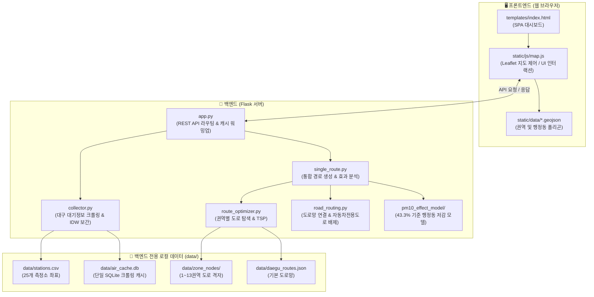

# 🚛 대구시 분진흡입차량 AI 최적 경로 및 미세먼지 저감 관제 시스템

대구광역시 13개 청소 관리 권역의 **실시간 대기질(PM10/PM2.5) 공간 보간(IDW)**과 **분진흡입차량 AI 최적 운행 경로 생성**, 그리고 **환경부 공인 43.3% 저감 기준에 기반한 현실적인 미세먼지 저감 효과 분석 대시보드**입니다.

---

## 🌟 주요 기능 및 특징

1. **실시간 대기질 수집 및 읍면동 단위 IDW 공간 보간**
   - **대구광역시 실시간 대기정보(air.daegu.go.kr) 크롤링 연동**: 대구시 보건환경연구원 공식 사이트로부터 대구 25개 대기 측정소의 실시간 PM10, PM2.5, NO2, O3 데이터를 실시간 크롤링 및 로컬 캐싱.
   - **IDW(Inverse Distance Weighting, 역거리 가중법)**: 25개 측정소 실측치를 기반으로 대구시 140여 개 전체 행정동 중심점의 대기질을 실시간 보간 연산.
   - **Leaflet.js 히트맵/단계구분도(Choropleth)**: 행정동별 대기질 수준(좋음/보통/나쁨/매우나쁨)에 맞추어 지도에 동별 색상 레이어 표출.

2. **AI 기반 다중 차고지 & 다중 차량 최적 경로 생성**
   - **다중 차고지(Multi-Depot) 출발/복귀 지원**: 각 권역별 지정 차고지(북구청, 달서구청, 환경자원사업소 등)에서 출발하여 청소 후 안전하게 복귀하는 순환 경로 생성.
   - **오염도 가중치 기반 TSP(2-opt) 최적화**: 도로망 후보 노드 중 미세먼지 농도가 높은 취약 구역을 우선적으로 방문하도록 경로 최적화.
   - **다중 차량(2~3대) 작업 구역 균등 분할**: 복수 차량 투입 시 지리적/오염도 균형을 맞추어 차량별 청소 구역을 자동 분할 할당.
   - **도로 제약조건 및 안전성 확보**: 신천대로, 앞산순환로 등 **자동차전용도로를 배제**하고, 노드 간 직선 점프가 없는 실제 도로망 연결.

3. **환경부 공인 43.3% 기준 행정동 커버리지 저감 효과 분석**
   - **단순 일괄 적용 오류 방지**: 차량이 행정동을 통과했다고 전체가 일괄 감소하지 않으며, **경로가 실제로 청소한 도로 노드 비율(Coverage)**을 산출.
   - **현실적 실효 저감 모델**: 
     - $\text{행정동별 실효 저감률} = 43.3\% \times Coverage$
     - $\text{운행 후 행정동 PM10} = \text{운행 전 PM10} \times (1 - 0.433 \times Coverage)$
   - **기존 고정 노선(A·B·C) vs AI 추천 노선 정밀 비교**: 주행거리 단축률, 예상 소요시간, 행정동별 미세먼지 저감 효과를 대시보드 KPI 카드로 실시간 시각화.

4. **작업 지시서(Turn-by-Turn) 및 주행 시뮬레이터**
   - 순서별 경유지(Stops) 상세 테이블 제공 (클릭 시 해당 지점 지도 포커싱).
   - 좌회전/우회전/직진 내비게이션 안내 텍스트 및 주행 애니메이션 시뮬레이션 지원.

---

## 🛠️ 기술 스택 & 사용 라이브러리

| 분류 | 기술 / 라이브러리 | 용도 및 설명 |
| :--- | :--- | :--- |
| **Backend** | `Python 3.10+` | 백엔드 핵심 런타임 환경 |
| | `Flask (>=3.1.0)` | 경량 WSGI 웹 애플리케이션 프레임워크 & RESTful API 서버 |
| | `Gunicorn (>=21.2.0)` | 프로덕션 배포용 고성능 Python WSGI HTTP 서버 |
| | `BeautifulSoup4 (>=4.12.0)` | 대구시 보건환경연구원 실시간 대기정보 HTML 웹 크롤링 및 파싱 |
| | `urllib` / `requests (>=2.31.0)` | 외부 HTTP 요청 및 SSL 통신 제어 |
| | `SQLite3` (내장) | 대기 크롤링 실시간 응답 2단계 영속 캐시 DB (`air_cache.db`) |
| | `pandas` / `numpy` | 대기질 데이터 전처리, 통계 산출 및 수치 행렬 연산 |
| **Frontend** | `HTML5` / `CSS3` (Vanilla) | 반응형 다크 테마 대시보드 UI 및 Glassmorphism 디자인 시스템 |
| | `JavaScript (ES6+)` | 비동기 Fetch API 통신 및 UI 동적 인터랙션 |
| **Web GIS** | `Leaflet.js (v1.9.4)` | 오픈소스 인터랙티브 웹 지도 렌더링 엔진 (API 키/비용 무료) |
| | `CartoDB Dark Matter` | 다크 테마 일반 도로망 베이스 타일맵 |
| | `Esri World Imagery` | 고해상도 항공 위성사진 베이스 타일맵 |
| | `GeoJSON` | 대구 13개 권역 및 140개 행정동 정밀 경계 지리 벡터 데이터 |
| **Algorithms** | `IDW (Inverse Distance Weighting)` | 25개 측정소 기반 140개 행정동 대기질 공간 보간 알고리즘 |
| | `TSP (2-opt Heuristic)` | 미세먼지 오염도 가중 외판원 문제(TSP) 도로망 순회 최적화 |
| | `PM10 Proxy Effect Model` | 환경부 공인 43.3% 기준 행정동 커버리지 실효 저감률 산출 모델 |
| | `Vector Turn-Guidance` | 주행 각도 벡터 기반 턴바이턴(좌/우회전) 음성·텍스트 안내 생성 |
| **UI & Assets** | `Lucide Icons` | 직관적인 경량 SVG UI 벡터 아이콘 CDN |
| | `Google Fonts` | `Pretendard`, `Outfit` 모던 웹 폰트 |

---

## 🏛️ 시스템 아키텍처 & 데이터 흐름



---

## 📂 프로젝트 폴더 구조

```text
dust/
│
├── 📁 data/                           # [서버 전용 내부 데이터베이스]
│   ├── air_cache.db                  # 🌟 대구시 대기정보 실시간 크롤링 SQLite 단일 캐시 DB
│   ├── realtime_idw/                 # 읍면동별 IDW 대기질 보간 연산 결과 CSV
│   ├── zone_nodes/                   # 1~13권역별 도로 탐색 후보 노드 (zone1~13.json)
│   ├── daegu_routes.json             # 13개 전 권역 도로망 지오메트리 & 기본 노선
│   └── stations.csv                  # 대구 25개 대기 측정소 위경도 메타데이터
│
├── 📁 pm10_effect_model/              # [PM10 도로 미세먼지 저감 산출 모델]
│   ├── __init__.py                   # 패키지 진입점 (evaluate_proxy_routes 노출)
│   ├── proxy_integration.py          # 🌟 행정동 커버리지 기반 43.3% 실효 저감률 계산 어댑터
│   ├── official_reference_model.json # 환경부/한국환경공단 공인 기준 계수 메타데이터
│   ├── effect_model.py               # 회귀분석 및 교차검증(LOEO) 원천 엔진
│   └── README.md                     # 모델 수학적 원리 및 한계점 설명 문서
│
├── 📁 static/                         # [웹 프론트엔드 정적 에셋]
│   ├── css/
│   │   └── style.css                 # 다크 테마 대시보드 및 Leaflet 지도 UI 스타일
│   ├── data/
│   │   ├── daegu_15_urban_zones.geojson # 13개 청소 관리 권역 경계 폴리곤
│   │   └── daegu_dong.geojson        # 대구시 전체 140여 개 행정동 정밀 경계 폴리곤
│   └── js/
│       ├── zones.js                  # 13개 권역 기본 정보(중심점, 줌, 소속 동, 차고지)
│       └── map.js                    # Leaflet 렌더링, API 비동기 통신, 주행 시뮬레이터
│
├── 📁 templates/                      # [HTML 템플릿]
│   └── index.html                    # 단일 페이지(SPA) 메인 대시보드 뷰
│
├── 🐍 백엔드 핵심 파이썬 스크립트:
│   ├── app.py                        # Flask 웹 애플리케이션 엔드포인트 & 캐시 워밍업
│   ├── config.py                     # 대구시 좌표, 구/군 매핑, 파일 경로 등 전역 설정
│   ├── collector.py                  # 대기질 API 크롤링 & 140개 읍면동 IDW 공간 보간
│   ├── single_route.py               # 🌟 AI 경로 생성, 다중 차고지/차량 분할, 턴바이턴 안내
│   ├── route_optimizer.py            # 권역별 노드 클러스터링 & 오염도 가중 TSP(2-opt) 최적화
│   ├── road_routing.py               # 실제 도로 연결 및 신천대로 등 자동차전용도로 필터링
│   └── analyzer.py                   # 대시보드 접속 시 초기 KPI 통계 산출
│
├── requirements.txt                  # 파이썬 의존성 패키지 목록 (Flask, pandas, requests 등)
├── .gitignore                        # Git 버전 관리 제외 목록
└── README.md                         # 프로젝트 개요 및 실행 가이드
```

---

## 🚀 실행 방법

### 1. 필수 패키지 설치
```bash
pip install -r requirements.txt
```

### 2. Flask 웹 서버 가동
```bash
python app.py
```
*(서버 기동 시 백그라운드로 8개 자치구 대표 측정소 대기질 캐시 워밍업이 자동으로 진행됩니다.)*

### 3. 웹 브라우저 접속
👉 **http://127.0.0.1:5050** 또는 **http://localhost:5050**
